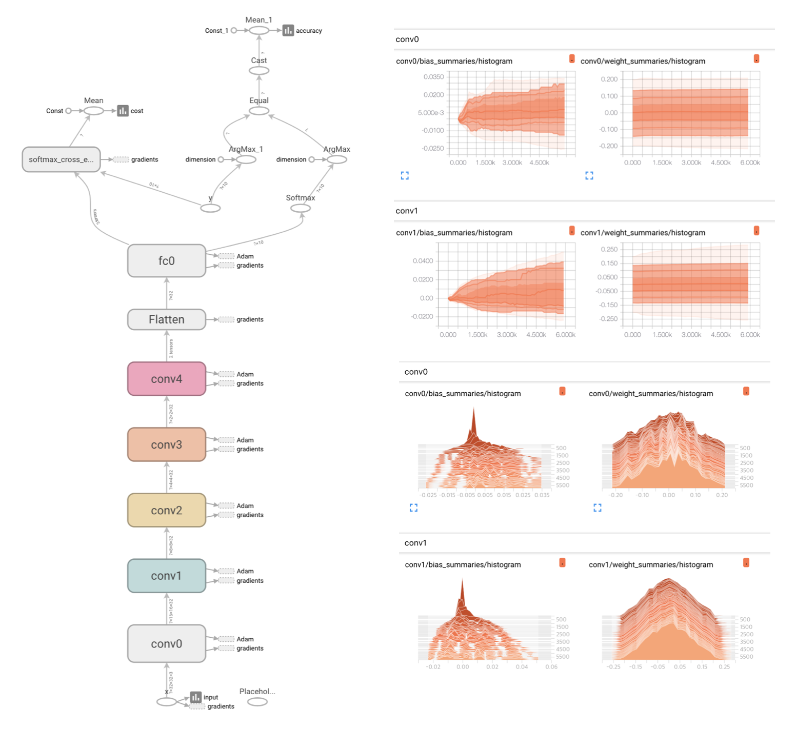

# Dog Breed Project

# Dataset Info

이 프로젝트는 강아지 사진을 입력으로 넣어 강아지의 품종을 구별해 내는 프로젝트 입니다.

# Requirement
- Python >= 2.x
- Tensorflow >= 1.x
- OpenCV >= 3.x
- Numpy / matplotlib/ imagaug / sci-kit

### classes : 119
### total Image : 20220

# Analysis
# Graph

